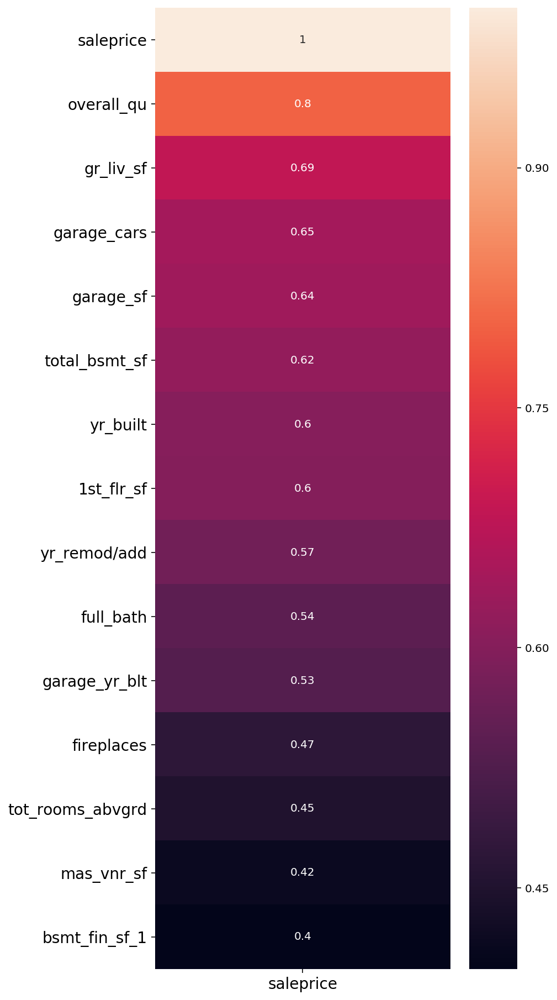
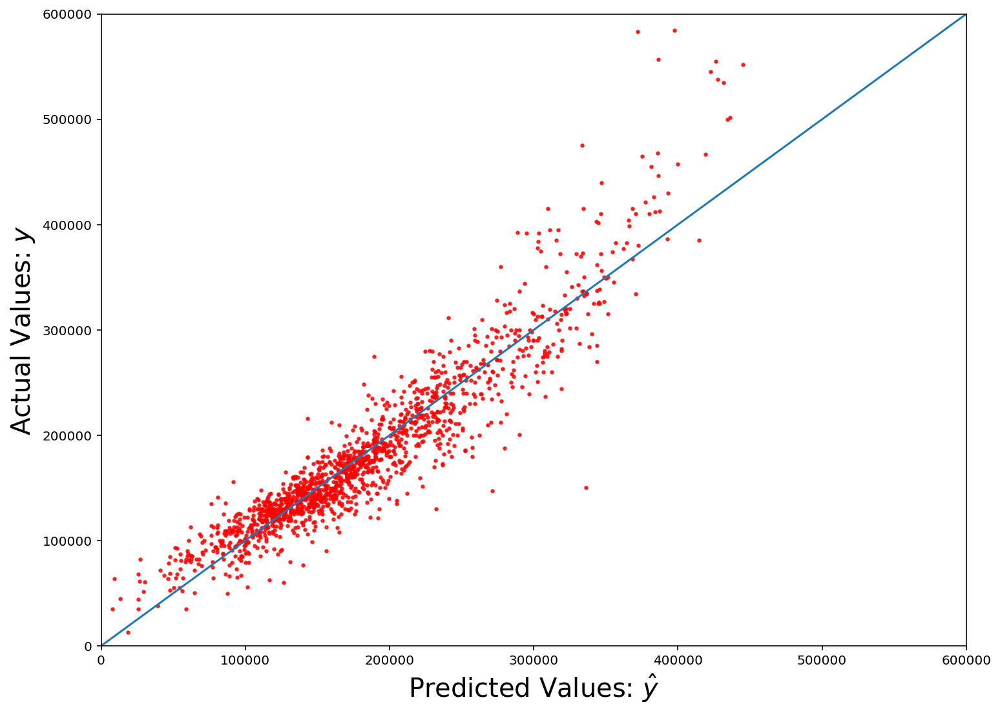

# Project 1: Aiming High in Ames

---

## **Problem Statement:**

​	HGTV has a new show airing this summer and they need to support the cast in predicting housing prices for the show. The premise of the show is relocating big city millennials experiencing the expensive prices and high demands of Los Angeles, San Francisco and Seattle. The show will take place in Ames Iowa. A charming town, Ames scored in the top 10 and 25 in over 40 prestigious metrics! From “Best Places for Entrepreneurs” by Entrepreneur Magazine , to “Healthiest City” by USA today, “Best Places for STEM Grads” by Nerdwallet, and “Best Places for Working Families” by SmartAsset, Ames is the place to be. Filming for each episode will be shot in one day with a new cast everyday for two weeks. With such a fast turn and heavy workload, the data science team is creating a machine learning algorithm to quickly, easily and best predict the housing prices of potential listings. 

[Link to Ames Accolades](https://www.cityofames.org/about-ames/awards-accolades-achievements)

[Link to Jupiter Notebook](./Project_2_Ames_Housing-Copy1.ipynb)

## **The Data:**

​	The data set incorporates housing information in Ames from years 2007-2010. There were 81 features, under the categories of square footage, utilities, neighborhood, finishes, room counts and closing information for 2051 unique entries. Values were either numerical, ordinal (Excellent, Good, Typical, Fair, Poor etc.), or nominal. 

​	The majority of columns did not have null values though 22% had at least one, and only 1% of columns had more than 5% of their values null. For features with numeric values, analysis showed that replacing null values with the average of the column had little effect on the generated algorithms.

## **Exploratory Data Analysis (EDA):**

​	I plotted the data for outliers, viewed the distributions, and investigated the data for trends, attempting to develop an accurate correlation of the data to sale price. Analysis demonstrated that excluding the outliers, houses over 350k dollars and houses larger than 4,000 square feet, reduced the Root Mean Squared Error (RMSE) by about 5k dollars. For the Aiming High in Ames project, that predictive capability will aid in guiding the cast to find the American Dream home on time. 

A correlation heatmap clearly depicts  which features have the highest correlation to sale price.

After multiple iterations, analysis showed that using the highest correlated features, aggregating similar features into one interaction term, and including dummy variables for the neighborhood feature garnered the best scores. The final features are listed below. 

|       |   fireplaces |   gr_liv_sf |   overall_qu |   mas_vnr_sf |   full_bath |   tot_rooms_abvgrd |   1st_flr_sf |     garage_score |       yr_score |      bsmt_score |  neighborhoods  | 
|:------|-------------:|------------:|-------------:|-------------:|------------:|-------------------:|-------------:|-----------------:|---------------:|----------------:|----------------:|
| description |number of fireplaces|living sq. ft.|overall quality| masonry veneer (brick, stone, wood etc.) sq. ft.| number of full bathrooms |total number of rooms (non-basement) |  1st floor sq. ft.| garage_sf x garage_cars x garage_yr_blt | yr_built x yr_remod/add x garage_yr_blt  |  total_bsmt_sf x bsmt_fin_sf_1   | 28 Neighnorhoods
| mean      |     0.589068 |    1495.55  |      6.10835 |      98.8074 |    1.57687  |            6.42899 |     1160.85  |      1.96126e+06 |    7.74305e+09 | 553322          | NA
| std       |     0.635842 |     485.784 |      1.42178 |     171.635  |    0.549389 |            1.54457 |      379.066 |      1.47394e+06 |    2.63735e+08 | 736670          | NA
| min       |     0        |     334     |      1       |       0      |    0        |            2       |      334     |      0           |    7.0025e+09  |      0          | NA
| 25%       |     0        |    1128     |      5       |       0      |    1        |            5       |      879     | 626880           |    7.52954e+09 |      0          | NA
| 50%       |     1        |    1444     |      6       |       0      |    2        |            6       |     1092     |      1.89341e+06 |    7.72716e+09 | 304300          | NA
| 75%       |     1        |    1728     |      7       |     158      |    2        |            7       |     1404     |      2.30054e+06 |    8.01201e+09 | 780066          | NA
| max       |     4        |    3820     |     10       |    1600      |    4        |           14       |     3820     |      1.17334e+07 |    8.1206e+09  |      5.4671e+06 | NA
| type      |    int       |    int      |    int       |    int       |    int      |    int             |    int       |    int           |    int         | int             | Object Dummies |
|Interation Term |   No     |   No |      No   |     No       |     No      |    No             |  No         |     Yes         |   Yes         |     Yes       |   No         |  No  

## **Model:**

Multi Linear Regression, Standard Scalar and Ridge all had similar outcomes on predicted sales prices as well as average error (RMSE). All three outperformed LASSO. Based on simplicity and comparable results I used Multi Linear Regression to get the R2 score for the final outcome. The final algorithm was able to predict, on average, about 88% of the variance expressed in the data within about 20k dollars of the actual sale price. As we can see in the graph below, houses valued under 350k dollars closely fit the linear regression line while houses over 350k or not as closely captured and were therefor left out of the final model (which was appropriate for Aiming High in Ames specifications). 

## **Future Recommendations:**
Though I was able to get RMSE down to nearly 20K dollars, it was only after removing houses over 350k dollars. It would be interesting to explore adding additional features, particularly ones that correlate with higher priced homes. I would also recommend manipulating the data with Polynomial Features, logarithms and squared terms to unveil any additional effects on the final predicted sale price. 
